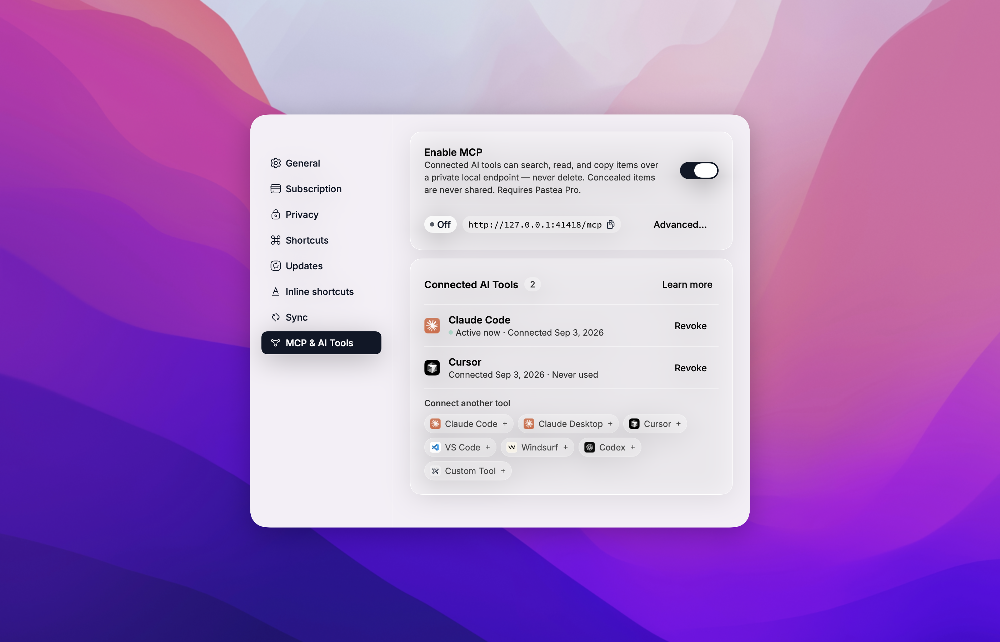

# Pastea MCP

[](https://github.com/pastea-app/pastea-mcp/releases/latest)
[](https://www.npmjs.com/package/pastea-mcp)
[](https://github.com/pastea-app/pastea-mcp/actions/workflows/ci.yml)
[](LICENSE)

**Local MCP server for [Pastea](https://pastea.app).** Give Claude, Cursor, Codex, VS Code and
other AI tools access to your Mac's clipboard history — without anything leaving your Mac.

Your assistant can search what you copied, pull a clip into context (including the text
Pastea reads inside your screenshots), and put a clip back on the clipboard for you to paste.

Pastea runs the MCP server itself, on `127.0.0.1` only. This package is the thin,
dependency-free bridge that AI apps launch: it finds Pastea, asks it for access once —
**you click Allow in Pastea** — and relays messages over stdio.

## Install

### Claude Desktop

One click from Pastea: open **Settings → MCP & AI Tools**, turn on **Enable MCP**, and click
**Claude Desktop**. Claude Desktop opens with the Pastea extension ready to install.

Or find **Pastea** in Claude Desktop under **Settings → Extensions → Browse extensions**, or
download `pastea-mcp-<version>.mcpb` from the
[latest release](https://github.com/pastea-app/pastea-mcp/releases/latest) and double-click it.

The first time Claude uses it, Pastea asks you to allow the connection.

### Every other AI app

Use [`add-mcp`](https://www.npmjs.com/package/add-mcp) to connect Pastea to all your installed
AI apps at once:

```bash
npx add-mcp pastea-mcp
```

Or connect each app yourself:

**Claude Code**

```bash
claude mcp add pastea -- npx -y pastea-mcp
```

**Codex**

```bash
codex mcp add pastea -- npx -y pastea-mcp
```

**Cursor**

[](https://cursor.com/en/install-mcp?name=pastea&config=eyJjb21tYW5kIjoibnB4IiwiYXJncyI6WyIteSIsInBhc3RlYS1tY3AiXX0%3D)

**VS Code**

[](https://insiders.vscode.dev/redirect/mcp/install?name=pastea&config=%7B%22command%22%3A%22npx%22%2C%22args%22%3A%5B%22-y%22%2C%22pastea-mcp%22%5D%7D)

**Anything else** that runs stdio MCP servers:

```json
{ "mcpServers": { "pastea": { "command": "npx", "args": ["-y", "pastea-mcp"] } } }
```

The first time an app uses Pastea, Pastea shows **"Allow &lt;app&gt; to use your clipboard
history?"** — click Allow and the tools appear.

### Connect from Pastea

Every app above can also be connected from inside Pastea — **Settings → MCP & AI Tools**,
click the app's chip. Cursor and VS Code open an install prompt; Claude Code, Windsurf and
Codex get the exact command or config to paste, already carrying an access token, so no
pairing prompt is needed.



## What your assistant can do

| Tool | What it does |
| --- | --- |
| `search_clips` | Search your clipboard history and lists — text, links, file names, and text recognized in screenshots. |
| `get_clip` | Read one clip in full, with a thumbnail for pictures. |
| `list_collections` | List your history and the lists you made, with counts. |
| `copy_clip` | Put a clip back on the system clipboard, exactly as copied. You paste it yourself with ⌘V. |
| `pastea_status` | Says whether Pastea is reachable and connected, and what to do if not. |

An AI tool can **never** delete a clip, never pastes into another app, and never sees items
Pastea conceals (from password managers).

## How pairing works

The bridge ships with no credentials. On first use it asks Pastea for access and Pastea shows
**"Allow Claude Desktop to use your clipboard history?"** (or Cursor, Codex, …). Click Allow
and the tools appear a moment later; click Don't Allow and nothing is granted — the assistant
gets a `pastea_status` tool that explains the situation.

Connections are listed in Pastea → **Settings → MCP & AI Tools → Connected AI Tools**, where
you can **Revoke** each one. Pastea then asks again only if you ask the assistant to reconnect.

## Requirements

- **macOS 15** or later
- **[Pastea](https://pastea.app) 1.3+** with **Pastea Pro**, and **Enable MCP** turned on in
  Settings → MCP & AI Tools
- For `npx` installs: **Node.js 20+** (Claude Desktop needs nothing — it ships its own)

## Privacy Policy

Pastea MCP runs locally on your Mac.

- It connects only to Pastea on `127.0.0.1` and to nothing else. It makes no network
  requests to Nexo Labs or any third party, and carries no analytics or telemetry.
- It moves clipboard data only between Pastea and the AI app that runs it, and only after
  you clicked Allow in Pastea. What that AI app does with clips it reads is governed by that
  app's own privacy policy.
- It stores one thing: the access token Pastea issued when you clicked Allow, in
  `~/Library/Application Support/Pastea/MCP Bridge/tokens.json`, readable by your user
  account only. Revoking the connection in Pastea invalidates it immediately; uninstalling
  Pastea removes the file.
- Concealed clips are never available to it, and it cannot delete anything.

Full policy — what data Pastea processes, how it is stored, sharing, retention, and contact:
**<https://pastea.app/privacy>**.

## Troubleshooting

**"Pastea isn't running, or its MCP endpoint is turned off."**
Open Pastea and turn on **Enable MCP** in Settings → MCP & AI Tools, then ask the assistant to
call `pastea_status`.

**"Pastea Pro is required."**
MCP access is a Pro feature. Subscribe in Pastea's Settings, then call `pastea_status`.

**"Pastea is asking the user to allow this connection."**
Look for the Pastea window — it may be behind the AI app — and click **Allow**.

**The tools vanished.**
The connection was revoked in Pastea, or Pastea was reset. Ask the assistant to call
`pastea_status` to pair again.

**Tools don't show up after connecting.**
Fully quit and reopen the AI app so it relaunches the bridge.

**Changed Pastea's port?**
The bridge reads it from Pastea's preferences on every launch; restart the AI app.

Logs for Claude Desktop: `~/Library/Logs/Claude/mcp-server-Pastea.log`. The bridge never logs
the token.

## Development

```bash
npm install
npm test            # node --test, no network
npm run build       # tsc → dist/
scripts/pack.sh     # validate + pack → build/pastea-mcp-<version>.mcpb + SHA256SUMS
```

Run it against a development Pastea by hand:

```bash
PASTEA_MCP_URL=http://127.0.0.1:41418/mcp node dist/index.js
```

then type JSON-RPC lines on stdin (`initialize`, `notifications/initialized`, `tools/list`).
Releases are cut by tagging `v<version>` (matching `package.json`, `manifest.json`,
`server.json` and `src/version.ts`); the workflow packs the bundle and publishes it.

## Contributing

Issues and pull requests welcome — see [the issue tracker](https://github.com/pastea-app/pastea-mcp/issues).

## License

[MIT](LICENSE) © [Nexo Labs](https://pastea.app)
